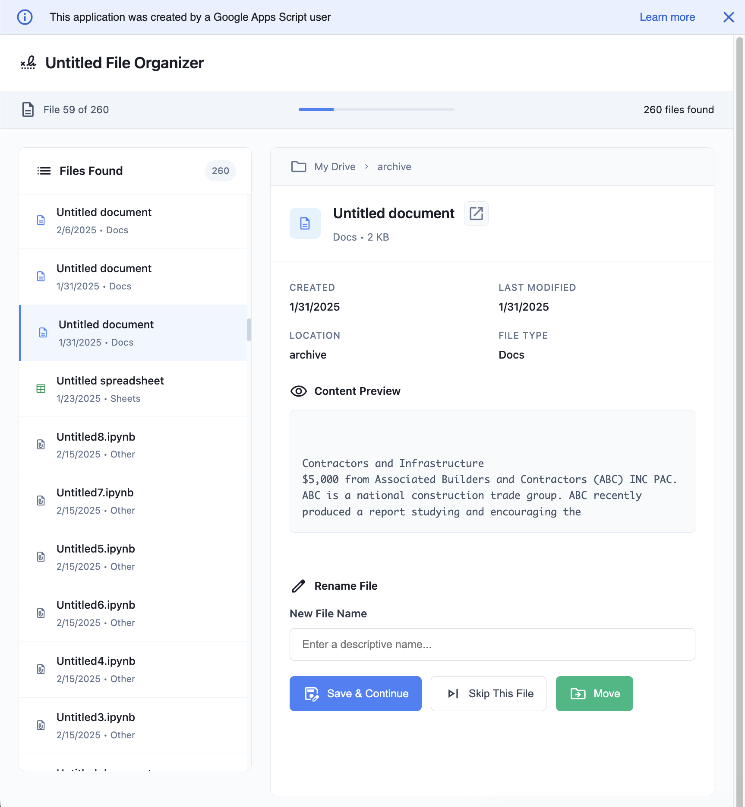
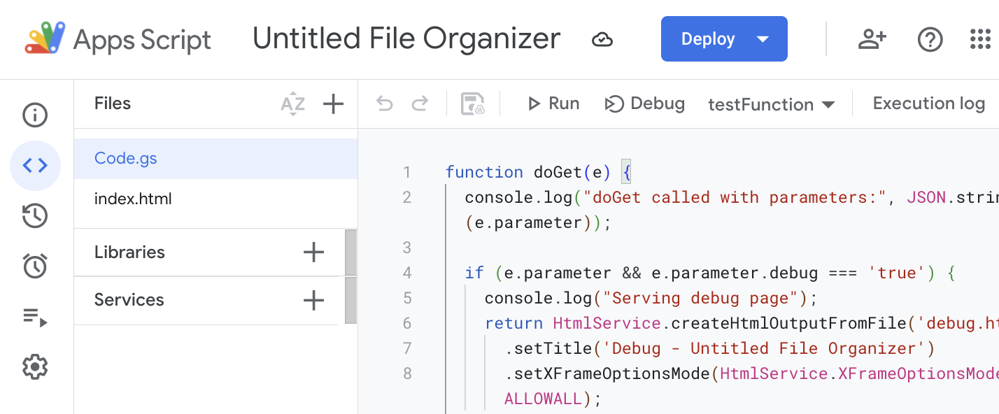

# Google Drive Untitled File Organizer

This is a simple web app to find and rename any default named "Untitled document", "Untitled presentation", and "Untitled spreadsheet" files cluttering up your Google Drive.

## Quick Start

**[Open the App](https://script.google.com/macros/s/AKfycbwZXfxFgKUc9lPol8MNL3qrEKBo2ePPab1jJytCxE8/dev)**

1. Click the link above
2. Grant permissions when prompted (see [what access it needs](#what-data-access-does-this-need) below)
3. Wait for it to scan your Drive for untitled files
4. Go through each file and rename it or move it to a better folder

## Run Your Own Google Apps Script Version

Want to run this yourself? Here's how:

1. Go to [script.google.com](https://script.google.com)
2. Create a new project
3. Replace the default `Code.gs` with the contents of [`code.gs`](code.gs)

4. Create a new HTML file called `index.html` and paste in the contents of [`index.html`](index.html) 
5. Deploy it as a web app (set execution to "Execute as me" and access to "Only myself")
6. Open your deployed URL

## How It Works

The app searches your Google Drive for files with "Untitled" in the name, then gives you a clean interface to:

- **Preview** the content of each file
- **Rename** files with descriptive names
- **Move** files to better organized folders
- **Skip** files you want to leave as-is

It loads files in chunks so it doesn't time out on large Drive accounts, and runs entirely in your browser with Google Apps Script.

## What Data Access Does This Need?

The app needs pretty broad Google Drive permissions to find, rename, and move your files:

| Scope | What It Does |
|-------|-------------|
| [Google Drive](https://developers.google.com/drive/api/guides/about-auth) | See, edit, create, and delete all of your Google Drive files |
| [Google Docs](https://developers.google.com/docs/api/guides/authorizing) | See, edit, create, and delete all your Google Docs documents |
| [Google Sheets](https://developers.google.com/sheets/api/guides/authorizing) | See, edit, create, and delete all your Google Sheets spreadsheets |
| [Google Slides](https://developers.google.com/slides/api/guides/authorizing) | See, edit, create, and delete all your Google Slides presentations |

**The app only renames and moves files** - it doesn't delete anything or modify file contents.

The deployed version collects basic, anonymous analytics (number of users, executions, errors) through Google Apps Script's default built-in metrics.

## Feedback Welcome

This is a rough utility I built for myself because I couldn't find anything else that did exactly what I wanted. If you find it useful or run into issues: [email me](mailto:nielsenau@gmail.com) or [open an issue](../../issues).

Built with Google Apps Script + vanilla HTML/CSS/JS.